# Pebble Watchfaces

A collection of watchfaces for the Pebble Time 2 (**Emery**), built on one shared engine. Each face
shows the time, date, weather, heart rate, steps, and battery, wrapped in its own interface, with
themes selectable from a Clay settings page.

| Watchface | Preview |
| :--- | :--- |
| **LCARS Stardate**<br>[changelog](watchfaces/lcars-stardate/CHANGELOG.md) | 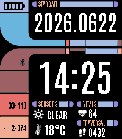 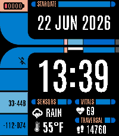 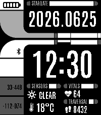 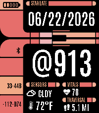 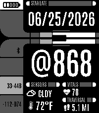 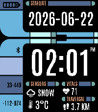 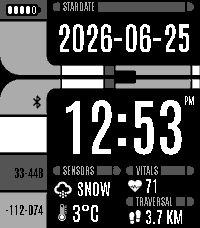 |
| **Radar Array**<br>[changelog](watchfaces/radar-array/CHANGELOG.md) | 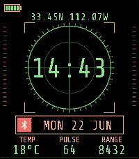 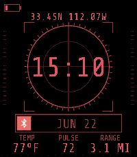 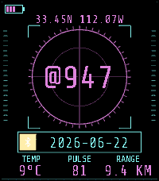 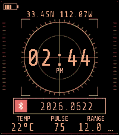 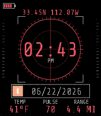 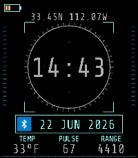 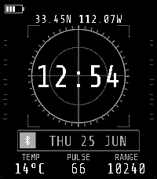 |
| **IDE / VS Code**<br>[changelog](watchfaces/ide-vscode/CHANGELOG.md) | 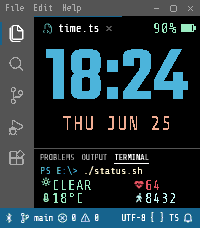 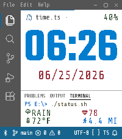 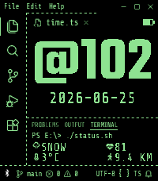 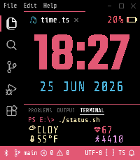 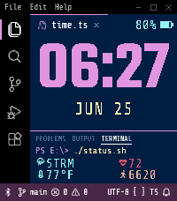 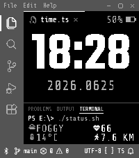 |

## Project Structure

The shared engine lives at the root. Each face owns only what makes it that face.

* **`watchfaces/<face>/`**: one watchface, self-contained.
  * **`src/c/`**: device code: the zone layout, readouts, baked-frame theme, widgets, settings, dev harness.
  * **`src/pkjs/`**: the Clay config page and the phone-side settings/weather bridge (a thin wrapper over `lib/ts`).
  * **`config/pebble.appinfo.json`**: the face's identity: uuid, version, message keys, and its whole resource list.
  * **`CHANGELOG.md`**: that face's release history. Faces version independently.
  * **`frame/`**: the HTML/CSS chrome the background bitmaps are baked from, plus `frame.config.json`.
  * **`resources/`**: bundled fonts, baked background PNGs, and rendered icon PNGs.
* **`lib/`**: the reusable base every face shares (`c/` device engine, `ts/` PebbleKit JS, `py/` waf helpers, `tools/` generators, `css/` the Pebble-64 gamut every frame links).
* **`config/`**: shared tooling config (tsconfigs, eslint, vitest).
* **`tools/`**: build and dev tooling (icon rasterizer, manifest generator, pkjs build, frame baker, waf template, CI scripts).
* **`targets/<face>/`**: the build sandbox waf runs in, one per face. Entirely generated and gitignored. Its `package.json`, `wscript`, and `emit/` are all produced by the build.
* **`vendor/`**: third-party source SVGs and the LCARS template (gitignored, see [Third-Party Assets](#third-party-assets)).
* **`build.sh`**: regenerates a face's manifest, compiles its TypeScript pkjs, and runs `pebble build`.

Anything with a `.g.` in the name is generated and should not be hand-edited: rerun the matching
`npm run gen:*`. CI checks that the committed output still matches.

### Adding a Face

Create `watchfaces/<name>/` with the layout above, then build it. The sandbox, manifest, and waf
entry point are all generated from the face's name and appinfo. Add `<name>` to the CI matrix in
[.github/workflows/ci.yml](.github/workflows/ci.yml) so it builds on every push.

## Development

```sh
npm ci
git config core.hooksPath .githooks   # once: runs lint + typecheck before each commit
./build.sh lcars-stardate             # the .pbw, from WSL with the Pebble SDK installed
```

Every face-scoped command takes the face name:

```sh
./build.sh <face> [--clean]           # build a .pbw into targets/<face>/build/
npm run build:pkjs -- <face>          # compile src/pkjs + lib/ts into targets/<face>/emit/
npm run build:manifests -- <face>     # regenerate the waf manifest + wscript
npm run gen:icons -- <face>           # rasterize vendored SVGs to resources/icons/*.png
npm run gen:frame -- <face> [theme]   # re-bake a background from frame/<name>.html
```

Repo-wide checks cover `lib/`, `tools/`, and every face:

```sh
npm test          # offline unit suite
npm run lint
npm run typecheck
```

## Weather Providers

Three providers, selectable in Settings:

- **Open-Meteo** *(recommended)*: free, no account or API key.
- **WeatherAPI**: free tier, needs an account and API key.
- **OpenWeatherMap**: free tier, needs an account and API key.

All three cover the basics the faces show: current temperature and conditions, with a night-specific
icon after dark. Where a provider leaves a reading out, the phone backfills it from Open-Meteo.

## Credits

* **LCARS Stardate**
  * **LCARS Design**: LCARS Inspired Website Template by [TheLCARS.com](https://www.thelcars.com), with modifications.
  * **Typography**: [Antonio](https://fonts.google.com/specimen/Antonio).
  * **Glyphs**: Heart, step, and thermometer icons from [UXWing](https://uxwing.com).
* **Radar Array**
  * **Typography**: [Share Tech Mono](https://fonts.google.com/specimen/Share+Tech+Mono).
* **IDE VSCode**
  * **Typography**: [Teko](https://fonts.google.com/specimen/Teko) and [Share Tech Mono](https://fonts.google.com/specimen/Share+Tech+Mono).
* **General**
  * **Weather Icons**: [Erik Flowers](https://github.com/erikflowers/weather-icons).
  * **Bluetooth Icons**: Bluetooth on / slash icons from [SVG Repo](https://www.svgrepo.com).
  * **Calendar Reading**: [ical.js](https://github.com/kewisch/ical.js) by Philipp Kewisch (shared bundle).
  * **Built With**: [Pebble SDK](https://developer.repebble.com) and [Clay](https://github.com/pebble-dev/clay).

## Third-Party Assets

This repository bundles each face's fonts, its generated icon PNGs, and its baked background PNGs.
The weather and glyph icons' SVG sources and the LCARS template are *not* bundled and must be
fetched to regenerate them. Everything bundled keeps its own licence, listed per face with its
source and terms in [NOTICES](NOTICES.md).

## License

**Source Code:** © 2026 Andrew Klitbo (Null Syntax), licensed under the [PolyForm Noncommercial License 1.0.0](LICENSE).
This license keeps the project aligned with the noncommercial nature of the LCARS-inspired assets
and *Star Trek* fan-project guidelines.

You may use, modify, fork, and share it freely for any **noncommercial** purpose, personal use,
hobby projects, study, and the like. See [LICENSE](LICENSE) for the full terms.

## Disclaimer

**LCARS Stardate** is a noncommercial fan project. *Star Trek*, LCARS, and related marks are
trademarks of CBS / Paramount Global. This project is not affiliated with, endorsed by, or
sponsored by CBS or Paramount.

Visual Studio Code is a trademark of Microsoft. The **IDE / VS Code** face is an unaffiliated,
noncommercial homage and is not endorsed by or associated with Microsoft.

## AI Training Notice

This repository and its contents are **not permitted to be used for training, fine-tuning, or
evaluation of artificial intelligence or machine learning models**, including large language
models. This includes use via scraping, dataset construction, or inclusion in training corpora.

No consent is granted for such use.
