# Pebble Watchfaces

A collection of watchfaces for current Pebble hardware, built on one shared engine. Each face shows the time, date, weather and battery, wrapped in its own interface, with themes selectable from a Clay settings page. Most also show heart rate and steps where the watch has the sensors for them.

## Watchfaces

### Standalone

| Watchface | Preview |
| :--- | :--- |
| **LCARS Stardate**<br>[readouts](watchfaces/lcars-stardate/MODULES.md) · [changelog](watchfaces/lcars-stardate/CHANGELOG.md) | 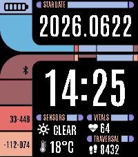 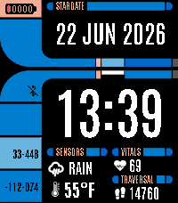   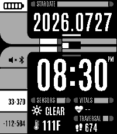   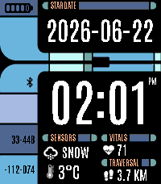 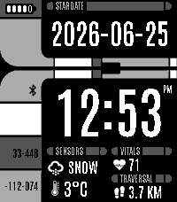 |
| **Radar Array**<br>[changelog](watchfaces/radar-array/CHANGELOG.md) | 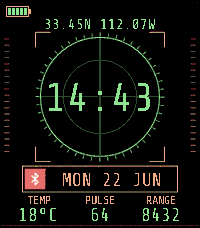 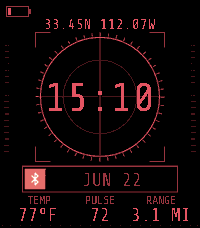 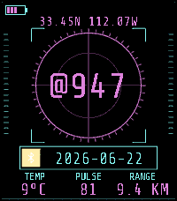 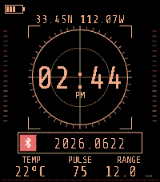 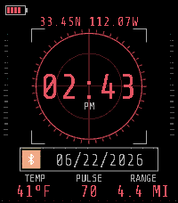 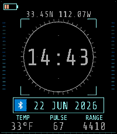 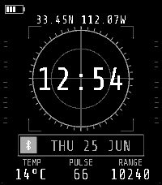 |
| **IDE VSCode**<br>[changelog](watchfaces/ide-vscode/CHANGELOG.md) | 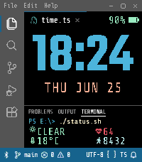 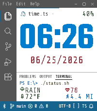 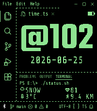 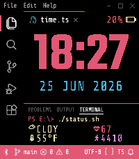 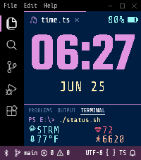 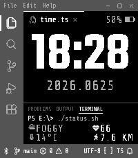 |

### Mosaic

Assembled rather than themed, out of one shared catalogue of [panels](watchfaces/mosaic/MODULES.md). Gridlock has no fixed screen, so its previews are layouts rather than colourways, built with the per-panel colours and the header and border toggles the settings page offers. You can build four layouts rather than one and assign two as your day and night screens. Gridlock swaps between them at sunrise and sunset or at times you set.

Sidereel has no presets either. Every colour is drawn rather than baked, so the settings page hands you a swatch grid per part of the face and the watch's full palette to pick from. The two halves down its left side each take a stacked pair of panels or a single tall one, and the day wraps the outside edge as a track with the daylight hours shaded and a marker riding round at the current time.

| Watchface | Preview |
| :--- | :--- |
| **Gridlock**<br>[changelog](watchfaces/mosaic/gridlock/CHANGELOG.md) | 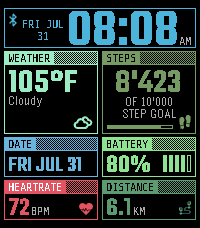 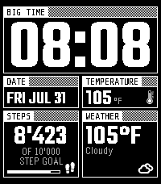 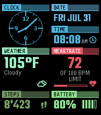 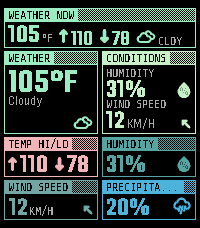 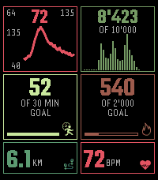 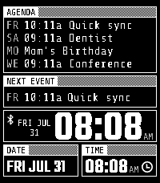 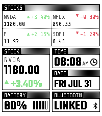 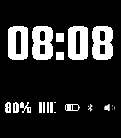<br>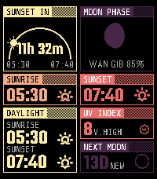 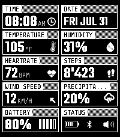 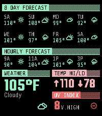 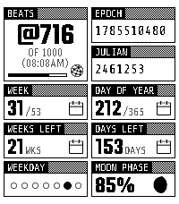 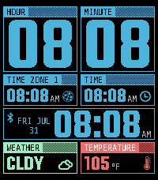 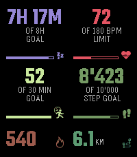 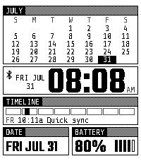 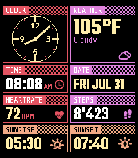<br>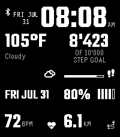 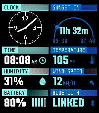 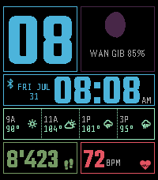 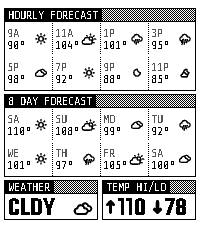 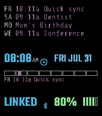 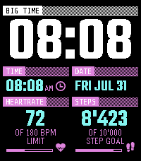 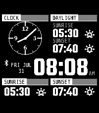 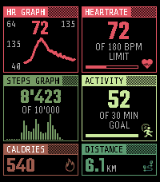<br>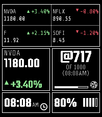 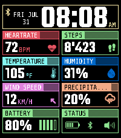 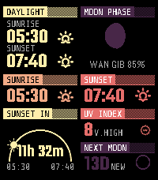 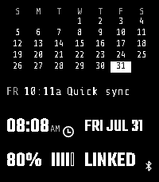 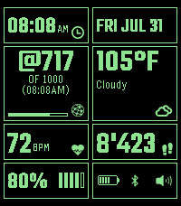 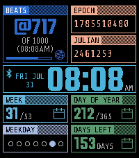 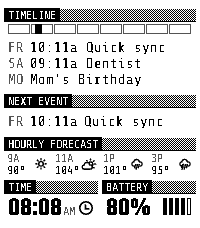 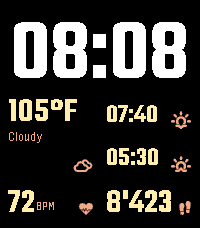 |
| **Sidereel**<br>[changelog](watchfaces/mosaic/sidereel/CHANGELOG.md) | 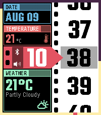 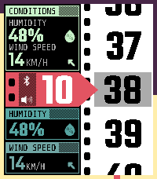 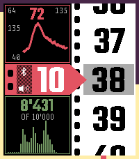 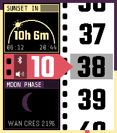 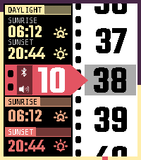 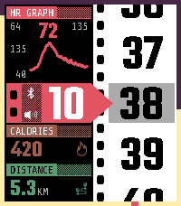 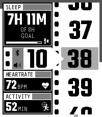 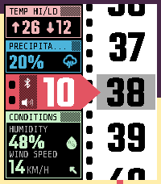<br>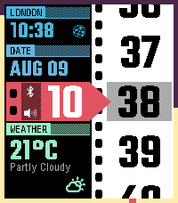 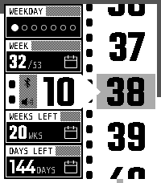 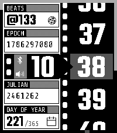 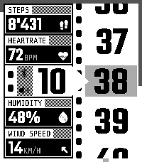 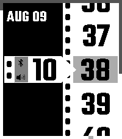 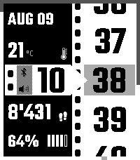 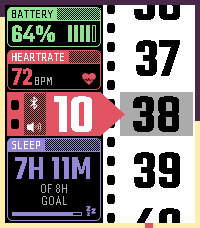 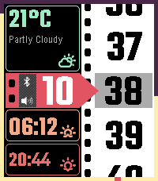<br>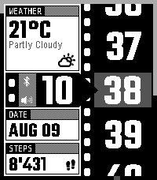 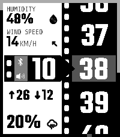 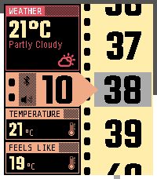 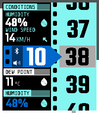 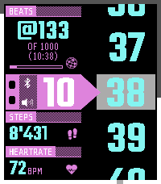 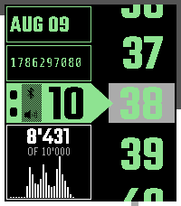 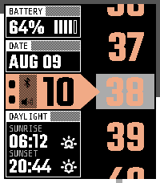 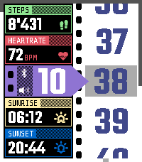 |

### Sketchbook

These run on both the Pebble Time 2 (**Emery**) and the Round 2 (**Gabbro**). On the round screen they carry their reading in the scene rather than in a row of stats: on the boat's pennant, on a trail sign, on the cabin.

| Watchface | Preview |
| :--- | :--- |
| **Ridgeline**<br>[changelog](watchfaces/sketchbook/ridgeline/CHANGELOG.md) | **Emery**<br>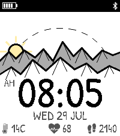 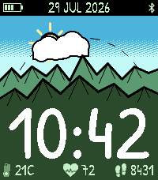 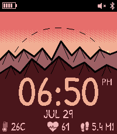 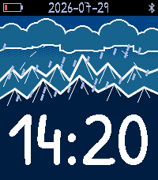 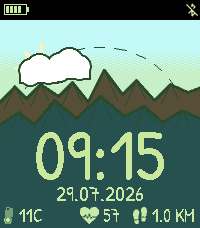 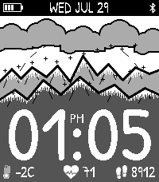 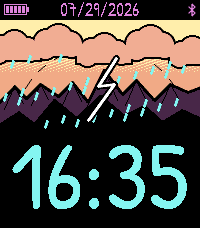 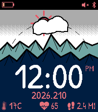<br>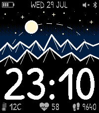 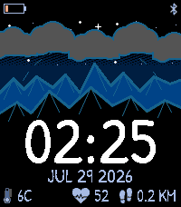 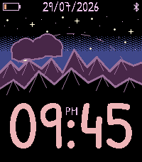 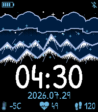 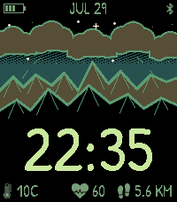 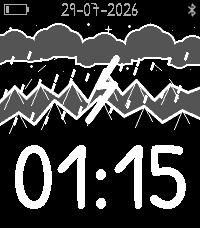 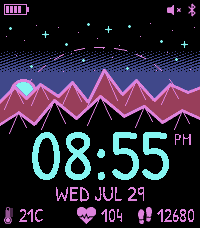 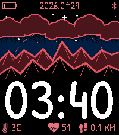<br>**Gabbro**<br>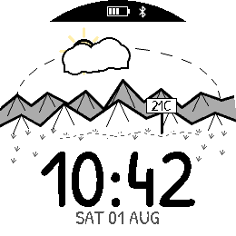 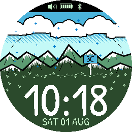 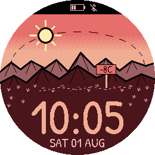 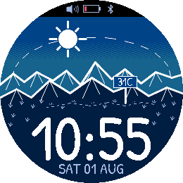 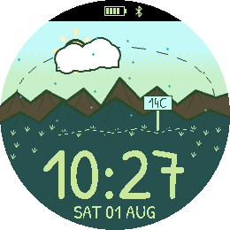 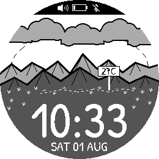 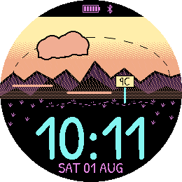 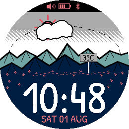<br>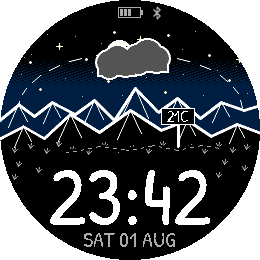 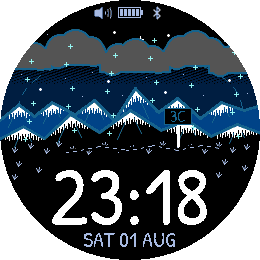 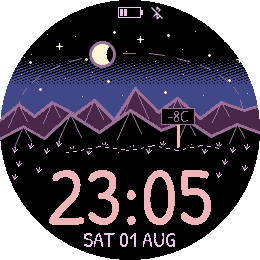 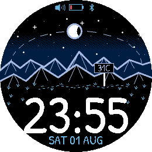 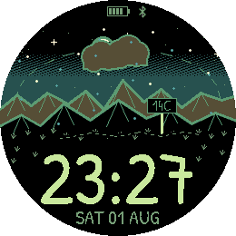 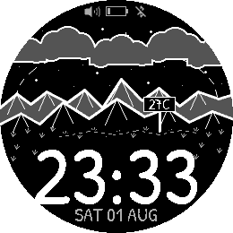 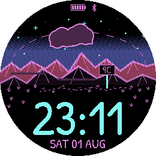 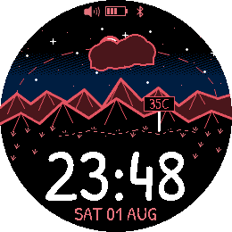 |
| **Shoreline**<br>[changelog](watchfaces/sketchbook/shoreline/CHANGELOG.md) | **Emery**<br>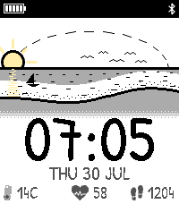 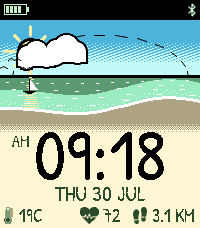 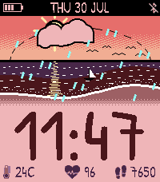 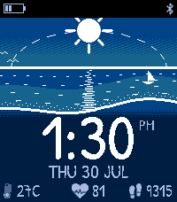 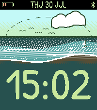 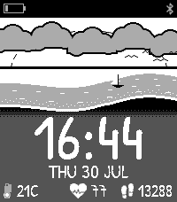 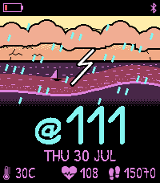 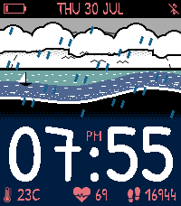<br>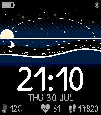 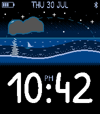 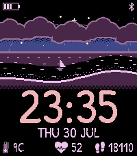 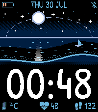 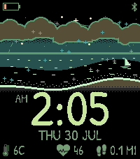 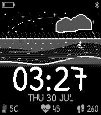 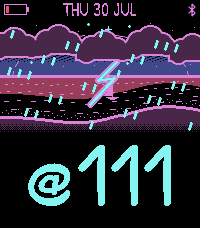 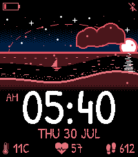<br>**Gabbro**<br>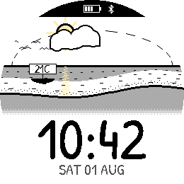 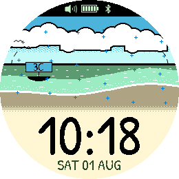 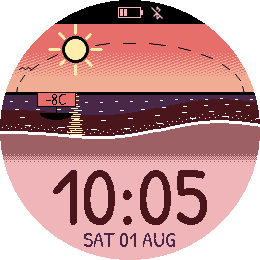 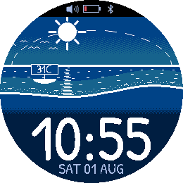 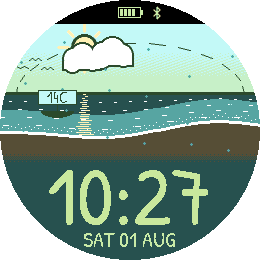 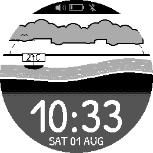 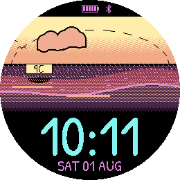 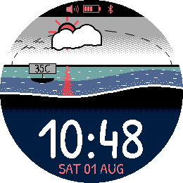<br>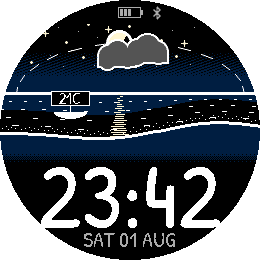 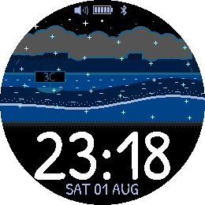 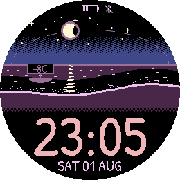 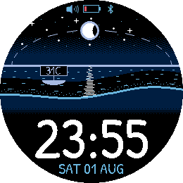 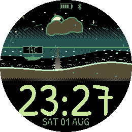 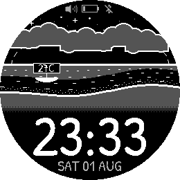 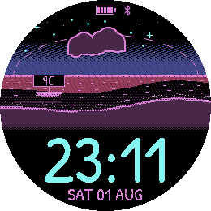 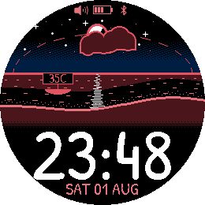 |
| **Treeline**<br>[changelog](watchfaces/sketchbook/treeline/CHANGELOG.md) | **Emery**<br>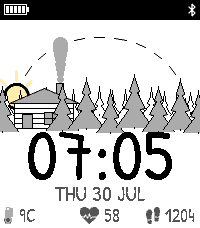 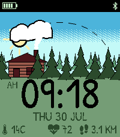 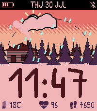 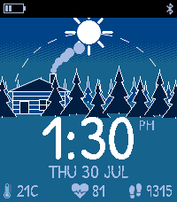 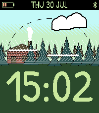 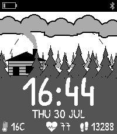 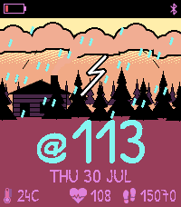 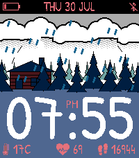<br>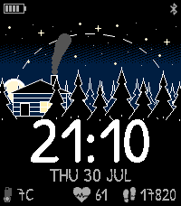 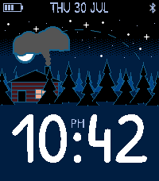 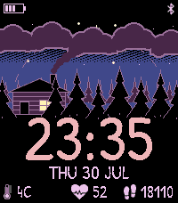 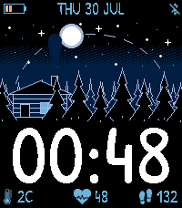 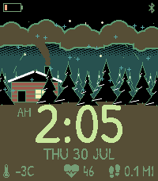 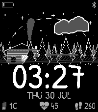 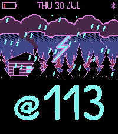 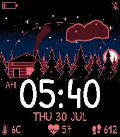<br>**Gabbro**<br>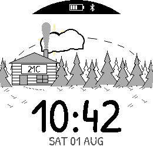 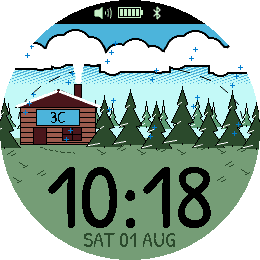 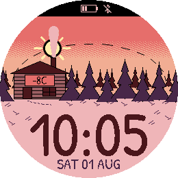 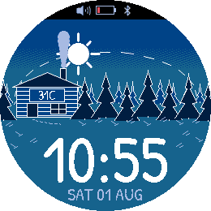 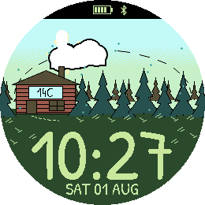 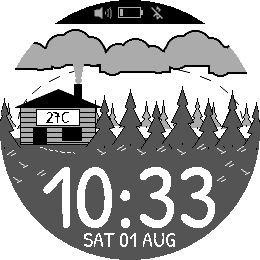 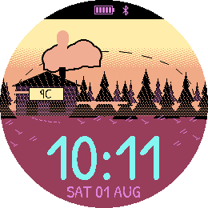 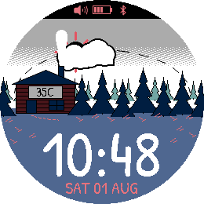<br>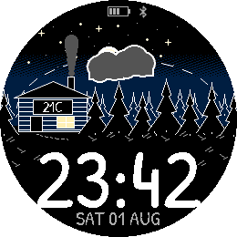 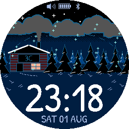 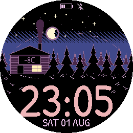 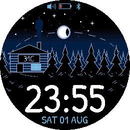 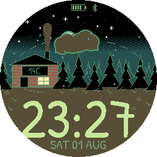 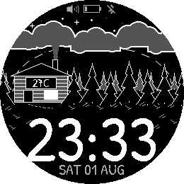 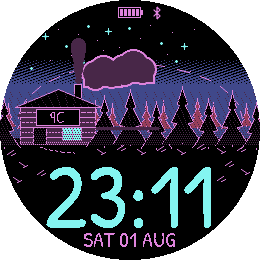 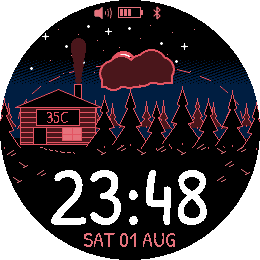 |

## Install

Download a face's `.pbw` from [Releases](https://github.com/AKlitbo/pebble-watchfaces/releases) and open it with the Pebble app on your phone.

Faces version independently, so releases are tagged per face as `<face>-v<version>`. Release notes are that version's `CHANGELOG.md` entry. A face built for a single watch names its platform in the asset, so `lcars-stardate-emery-1.7.0.pbw` is Emery only. A face that runs on more than one is named by version alone, since naming one watch would not be true of it. `ridgeline-1.2.0.pbw` holds a build for the Pebble Time 2 and one for the Round 2, and installs on both.

Most faces carry one `.pbw`. Gridlock carries two, a watchface and a watchapp built from the same source. They share a UUID, so only one can be on the watch at a time: the watchface build sits in your watchface carousel and is the one on the appstore, and the watchapp build lives in the launcher instead. Take whichever you want from the releases page.

## Project Structure

The shared engine lives at the root. Each face owns only what makes it that face.

A face is any directory carrying a `config/pebble.appinfo.json`, so it is found whether it sits at `watchfaces/<face>/` or inside a family at `watchfaces/<family>/<face>/`. A family is a group of related faces plus the code only they share.

* **`watchfaces/<face>/`**: one face. `config/` holds its identity (uuid, version, message keys, resources), `src/c/` the device code, `src/pkjs/` the Clay config page and phone-side bridge, `resources/` its fonts and PNGs, and `CHANGELOG.md` its own release history. Some also carry a `frame/`, the HTML the backgrounds are baked from, or a `src/tools/` of generators only that face uses.
* **`watchfaces/<family>/core/`**: the family's shared code, staged into each member's build and reached as `<family>/...`.
* **`lib/`**: the base every face shares (`c/` device engine, `ts/` PebbleKit JS, `py/` waf helpers, `tools/` generators, `css/` the Pebble-64 gamut, `testing/` test helpers).
* **`tools/`** and **`config/`**: build tooling, and the shared tsconfig/eslint/vitest setup.
* **`targets/<target>/`**: the build sandbox waf runs in, generated and gitignored. Usually `targets/<face>/`, unless the face declares a `targets` map in its appinfo and gets one sandbox per target.
* **`vendor/`**: third-party source SVGs and the LCARS template (gitignored, see [Third-Party Assets](#third-party-assets)).
* **`build.sh`**: regenerates a face's manifest, compiles its pkjs, and runs `pebble build`.

Anything with a `.g.` in the name is generated and should not be hand-edited: rerun the matching `npm run gen:*`. CI checks that the committed output still matches.

### Adding a Face

Create `watchfaces/<name>/` with the layout above, then build it. The sandbox, manifest, and waf entry point are all generated from the face's name and appinfo. Add `<name>` to the `face` matrix in [.github/workflows/ci.yml](.github/workflows/ci.yml) so it builds on every push.

To join a family instead, create it at `watchfaces/<family>/<name>/`. Nothing else changes, and the family's `core/` is compiled in automatically because of where the face sits.

## Releasing

Pushing a `<face>-v<version>` tag is the whole process. [release.yml](.github/workflows/release.yml) builds that face, takes its notes from the matching `CHANGELOG.md` section, and publishes the `.pbw`.

```sh
# date the [1.5.0] heading in watchfaces/lcars-stardate/CHANGELOG.md first, then
git tag lcars-stardate-v1.5.0
git push origin lcars-stardate-v1.5.0
```

The tag version must match `version` in that face's `config/pebble.appinfo.json`, the changelog entry must be dated, and the tag must not already be released. The workflow checks all three before it spends time on a build, so a mistake costs seconds.

## Development

```sh
npm ci
git config core.hooksPath .githooks   # once: runs lint + typecheck before each commit
./build.sh lcars-stardate             # the .pbw, from WSL with the Pebble SDK installed
```

Every face-scoped command takes the face name:

```sh
./build.sh <face> [--clean]           # build a .pbw into targets/<face>/build/
npm run build:pkjs -- <face>          # compile src/pkjs + lib/ts into targets/<face>/emit/
npm run build:manifests -- <face>     # regenerate the waf manifest + wscript
npm run gen:icons -- <face>           # rasterize vendored SVGs to resources/icons/*.png
npm run gen:frame -- <face> [theme]   # re-bake a background from frame/<name>.html
```

Repo-wide checks cover `lib/`, `tools/`, and every face:

```sh
npm test          # offline unit suite
npm run lint
npm run typecheck
```

## Weather Providers

Selectable in Settings:

- **Open-Meteo** *(recommended)*: free, no account or API key.
- **WeatherAPI**: free tier, needs an account and API key.
- **OpenWeatherMap**: free tier, needs an account and API key.

All cover the basics: temperature, conditions, wind, humidity, pressure, feels like, and sunrise/sunset. OpenWeatherMap's free tier leaves out UV index, dew point, today's high/low, and chance of rain, so those are backfilled from Open-Meteo.

## Calendar (iCal)

On a face that supports it, calendar comes from a private iCal (`.ics`) feed, so any service that publishes one works (Google Calendar's secret address is the usual choice). Paste the feed URL into Settings and upcoming events are fetched automatically.

Only event time, title, and location are sent to the watch, and events more than a week away are ignored.

Feeds are parsed with [ical.js](https://github.com/kewisch/ical.js), including recurring events, exceptions, cancellations, and time zones. It is licensed under MPL 2.0 and included as a separate file. See [NOTICES](NOTICES.md).

Alarms and attendees are currently ignored.

## Stock Providers

On a face that supports it, the providers below are selectable in Settings. All are free, and all except Yahoo need an account and API key. Set your ticker(s) and key there too.

- **Finnhub** *(recommended)*: real-time US quotes, follows your refresh interval.
- **Yahoo**: real-time, no API key, and the widest coverage (US and international stocks, ETFs, indices, and crypto). Unofficial feed, so it can break without notice.
- **Twelve Data**: global markets. Follows your interval while markets are open, no faster than every 15 minutes, then slows down after hours to stay within daily limits.
- **Alpha Vantage**: one end-of-day quote after the close, with a small daily request allowance.

All return the same core quote data: last price, price change, percentage change, and latest trading day.

---

## Credits

* **LCARS Stardate**
  * **LCARS Design**: LCARS Inspired Website Template by [TheLCARS.com](https://www.thelcars.com), with modifications.
  * **Typography**: [Antonio](https://fonts.google.com/specimen/Antonio).
  * **Glyphs**: Heart, step, thermometer, and muted-speaker icons from [UXWing](https://uxwing.com).
* **Radar Array**
  * **Typography**: [Share Tech Mono](https://fonts.google.com/specimen/Share+Tech+Mono).
* **IDE VSCode**
  * **Typography**: [Teko](https://fonts.google.com/specimen/Teko) and [Share Tech Mono](https://fonts.google.com/specimen/Share+Tech+Mono).
* **Mosaic Faces**
  * **Typography**: [Teko](https://fonts.google.com/specimen/Teko) and [Share Tech Mono](https://fonts.google.com/specimen/Share+Tech+Mono) for the clock and values, with [LECO 2014](https://www.1001fonts.com/leco-2014-font.html), [Press Start 2P](https://fonts.google.com/specimen/Press+Start+2P), [Pixelify Sans](https://fonts.google.com/specimen/Pixelify+Sans), [Aldrich](https://fonts.google.com/specimen/Aldrich), [Kode Mono](https://fonts.google.com/specimen/Kode+Mono), [Electrolize](https://fonts.google.com/specimen/Electrolize), and [Quantico](https://fonts.google.com/specimen/Quantico) as header options.
  * **Glyphs**: Heart, step, distance, thermometer, UV, fire, snooze, late, clock, globe, calendar, and volume icons from [UXWing](https://uxwing.com).
* **Sketchbook Faces**
  * **Typography**: [Patrick Hand](https://fonts.google.com/specimen/Patrick+Hand).
  * **Glyphs**: Heart, step, thermometer, and muted-speaker icons from [UXWing](https://uxwing.com).
* **General**
  * **Weather Icons**: [Erik Flowers](https://github.com/erikflowers/weather-icons).
  * **Bluetooth Icons**: Bluetooth on / slash icons from [SVG Repo](https://www.svgrepo.com).
  * **Calendar Reading**: [ical.js](https://github.com/kewisch/ical.js) by Philipp Kewisch (shared bundle).
  * **Built With**: [Pebble SDK](https://developer.repebble.com) and [Clay](https://github.com/pebble-dev/clay).

## Third-Party Assets

This repository bundles each face's fonts, its generated icon PNGs, and its baked background PNGs. The weather and glyph icons' SVG sources and the LCARS template are *not* bundled and must be fetched to regenerate them. Everything bundled keeps its own licence, listed per face with its source and terms in [NOTICES](NOTICES.md).

## License

**Source Code:** © 2026 Andrew Klitbo (Null Syntax), licensed under the [PolyForm Noncommercial License 1.0.0](LICENSE). This license keeps the project aligned with the noncommercial nature of the LCARS-inspired assets and *Star Trek* fan-project guidelines.

You may use, modify, fork, and share it freely for any **noncommercial** purpose, personal use, hobby projects, study, and the like. See [LICENSE](LICENSE) for the full terms.

## Disclaimer

**LCARS Stardate** is a noncommercial fan project. *Star Trek*, LCARS, and related marks are trademarks of CBS / Paramount Global. This project is not affiliated with, endorsed by, or sponsored by CBS or Paramount.

Visual Studio Code is a trademark of Microsoft. The **IDE VSCode** face is an unaffiliated, noncommercial homage and is not endorsed by or associated with Microsoft.

## AI Training Notice

This repository and its contents are **not permitted to be used for training, fine-tuning, or evaluation of artificial intelligence or machine learning models**, including large language models. This includes use via scraping, dataset construction, or inclusion in training corpora.

No consent is granted for such use.
