# Pebble Watchfaces

These are my Pebble watchfaces, all built on my shared [framework](https://github.com/AKlitbo/pebble-app-framework). Radar Array, IDE VSCode, Gridlock, and Sidereel run on the Pebble Time 2 (**Emery**). The Sketchbook faces run on the Time 2 and the Round 2 (**Gabbro**). Each one shows the time, the date, the weather, and the battery, and most add steps and heart rate where the watch has the sensors for them. You set each one up from its settings page on your phone.

## Install

Grab a face's `.pbw` from [Releases](https://github.com/AKlitbo/pebble-watchfaces/releases) and open it with the Pebble app on your phone.

Each face has its own version, and each release's notes are that version's entry in the face's changelog. A face for one watch has that watch in the file name, so `radar-array-emery-1.6.0.pbw` is for Emery only. A Sketchbook face holds a build for each watch, so its file is named by version alone, and `ridgeline-1.2.0.pbw` installs on the Time 2 and the Round 2.

Gridlock comes as two files built from the same code, a watchface (`gridlock-face-emery-<version>.pbw`) and a watchapp (`gridlock-app-emery-<version>.pbw`). They share a UUID, so only one can be on the watch at a time. The watchface sits in your watchface carousel and is the one on the appstore. The watchapp lives in the launcher instead.

## Watchfaces

### Standalone

| Watchface | Preview |
| :--- | :--- |
| **Radar Array**<br>[changelog](watchfaces/radar-array/CHANGELOG.md) | 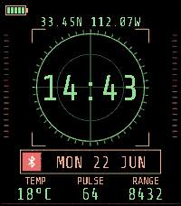 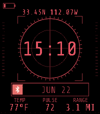 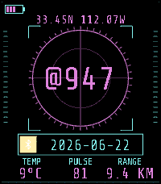 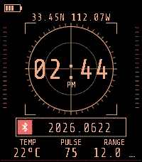 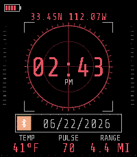 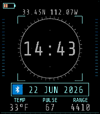 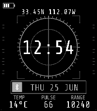 |
| **IDE VSCode**<br>[changelog](watchfaces/ide-vscode/CHANGELOG.md) | 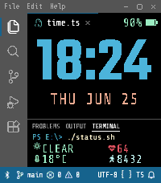 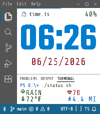 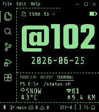 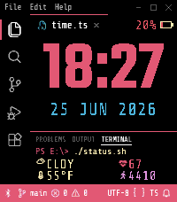 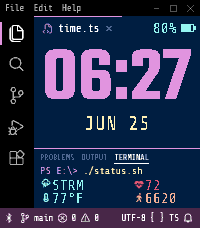 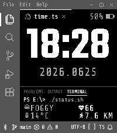 |

### Mosaic

The Mosaic faces have no fixed screen. You put them together in the settings page from one shared catalogue of [panels](watchfaces/mosaic/MODULES.md), and it keeps five layouts for you. One is your day screen. You can hand another the night, from sunset to sunrise or between times you set, and one more Quiet Time. Gridlock's previews are layouts rather than colourways, built with the per-panel colours and the header and border toggles its settings page offers.

Sidereel reads the time off a reel of minutes on the right, with an hour pointer on the left. The two boxes on the left each take a stacked pair of panels or one tall one. The day wraps the outside edge as a track, with the daylight hours shaded and a marker riding round at the current time. Beside the two Mono themes, Vibrant, and Custom, you can pick the pointer and the reel colours yourself from the watch's full palette.

| Watchface | Preview |
| :--- | :--- |
| **Gridlock**<br>[changelog](watchfaces/mosaic/gridlock/CHANGELOG.md) | 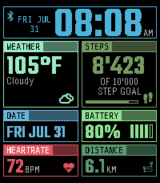 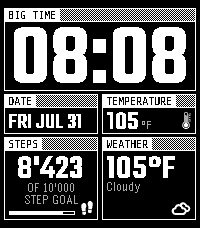 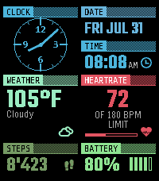 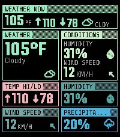 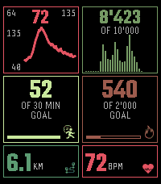 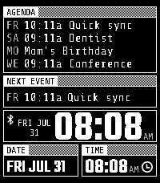 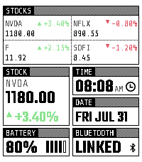 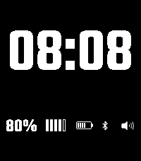<br>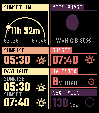 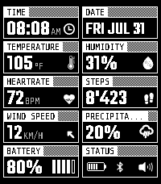 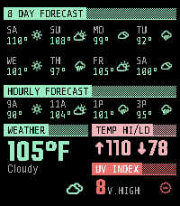 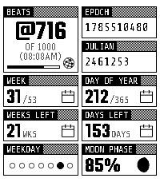 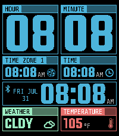 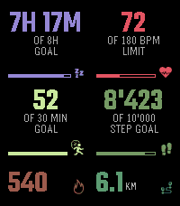 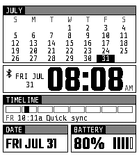 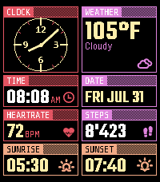<br>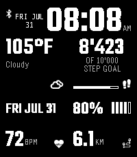 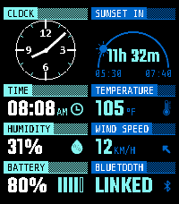 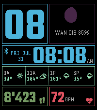 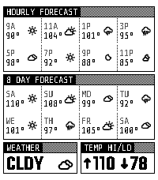 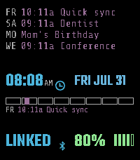 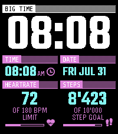 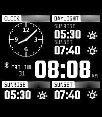 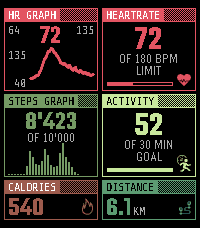<br>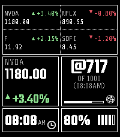 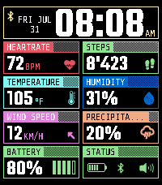 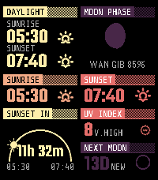 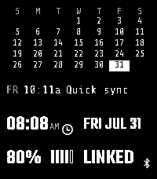 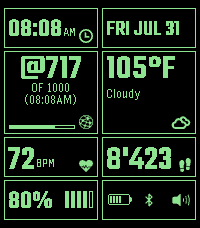 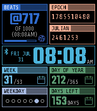 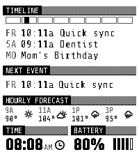 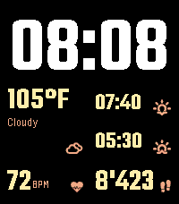 |
| **Sidereel**<br>[changelog](watchfaces/mosaic/sidereel/CHANGELOG.md) | 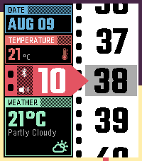 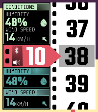 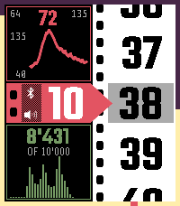  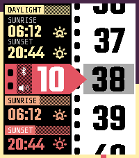 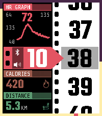 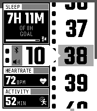 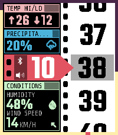<br>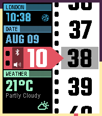 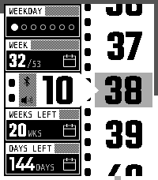 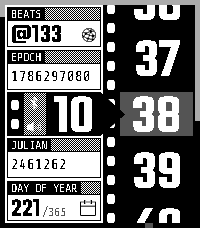 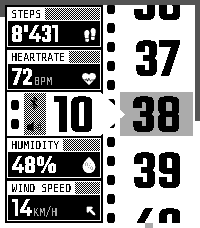 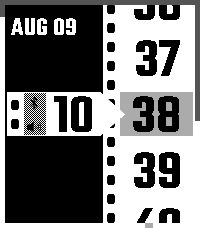 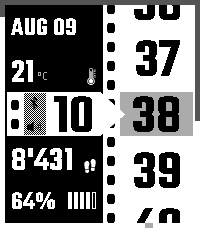 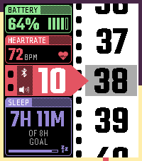 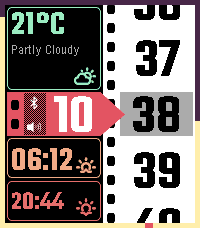<br>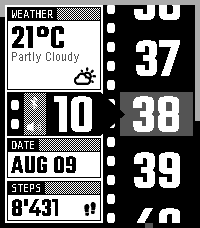 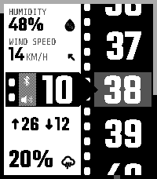 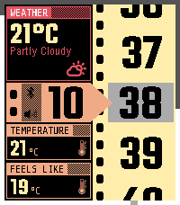 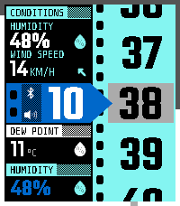 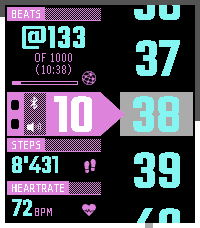 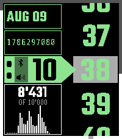 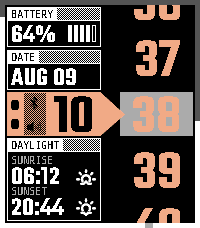 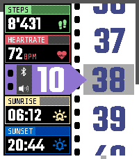 |

### Sketchbook

On the round screen the reading sits in the scene rather than in a row of stats, on Shoreline's pennant, Ridgeline's trail sign, and Treeline's cabin.

| Watchface | Preview |
| :--- | :--- |
| **Ridgeline**<br>[changelog](watchfaces/sketchbook/ridgeline/CHANGELOG.md) | **Emery**<br>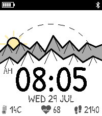 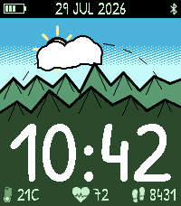 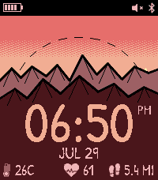 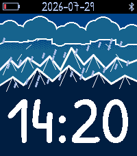 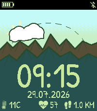 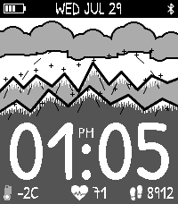 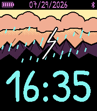 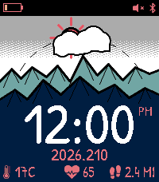<br>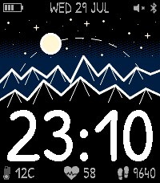 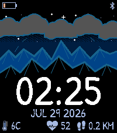 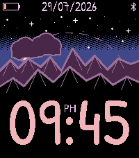 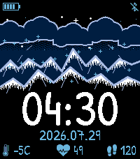 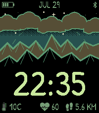 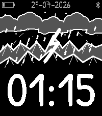 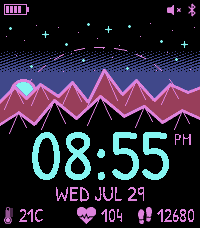 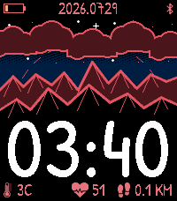<br>**Gabbro**<br>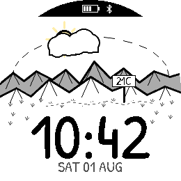 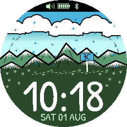 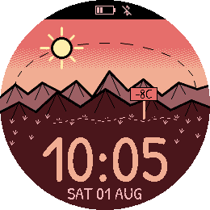 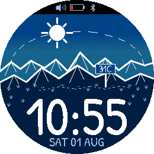 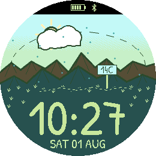 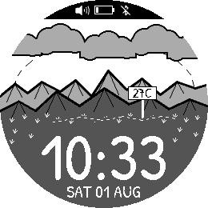 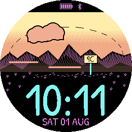 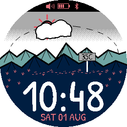<br>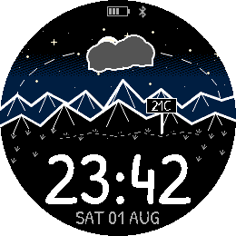 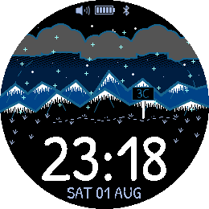 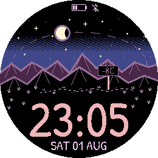 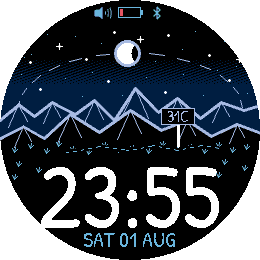 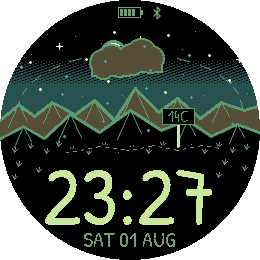 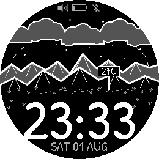 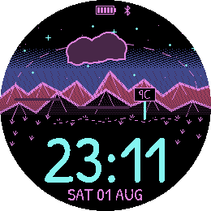 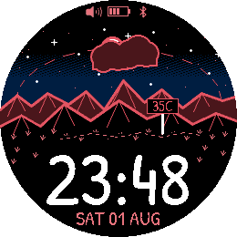 |
| **Shoreline**<br>[changelog](watchfaces/sketchbook/shoreline/CHANGELOG.md) | **Emery**<br>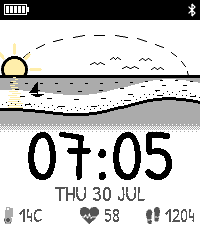 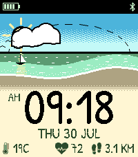 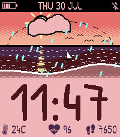 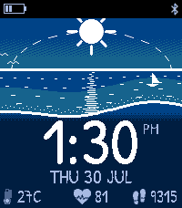 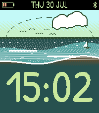 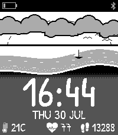 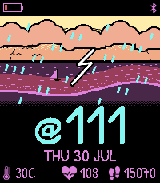 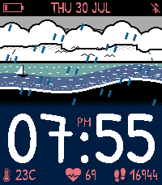<br>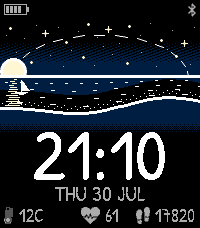 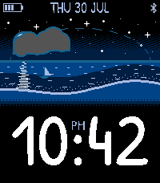 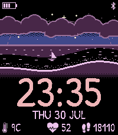 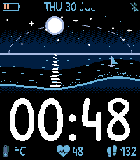 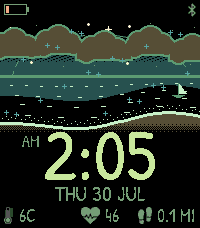 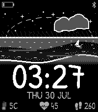 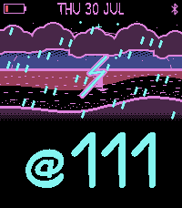 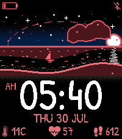<br>**Gabbro**<br>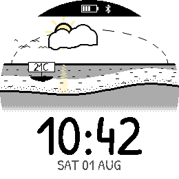 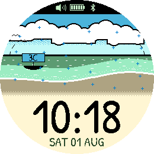 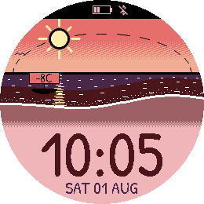 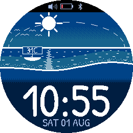 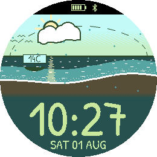 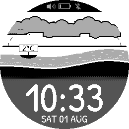 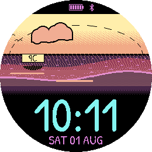 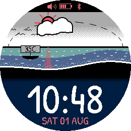<br>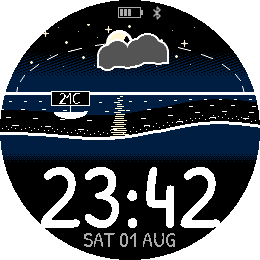 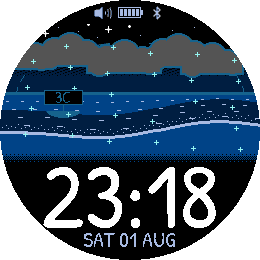 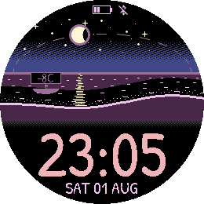 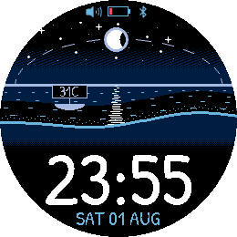 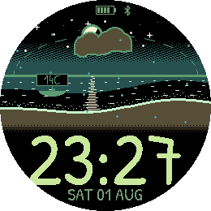 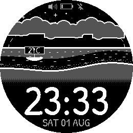 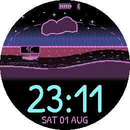 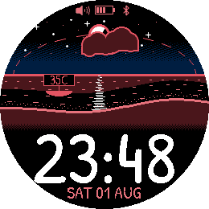 |
| **Treeline**<br>[changelog](watchfaces/sketchbook/treeline/CHANGELOG.md) | **Emery**<br>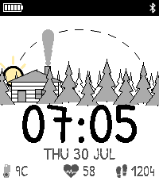 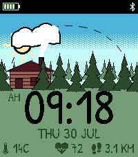 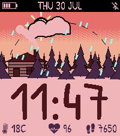 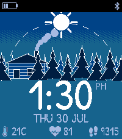 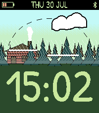 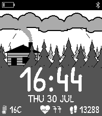 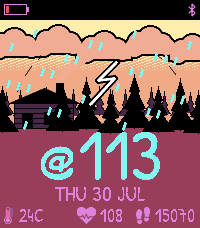 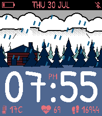<br>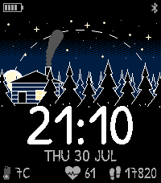 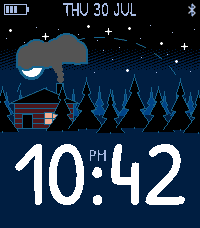 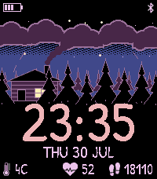 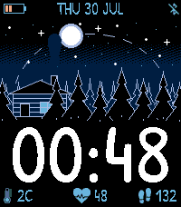 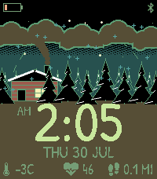 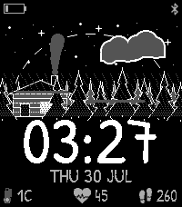 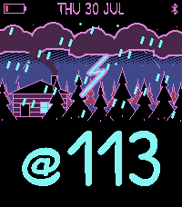 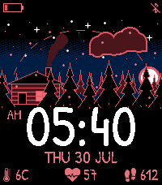<br>**Gabbro**<br>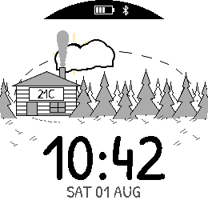 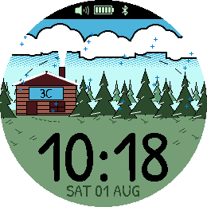 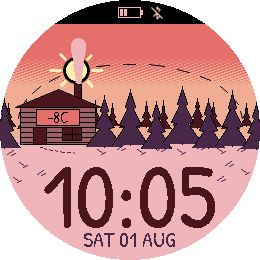 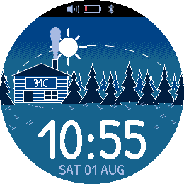 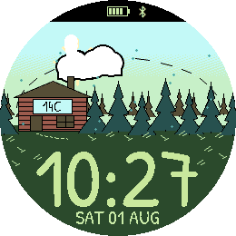 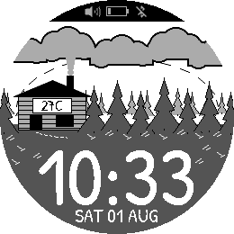 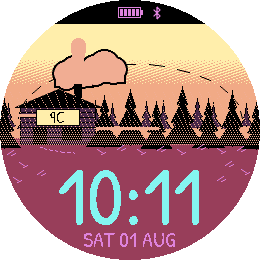 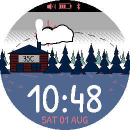<br>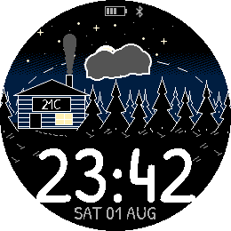 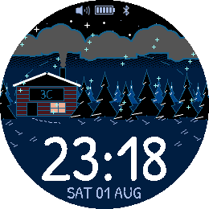 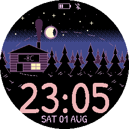 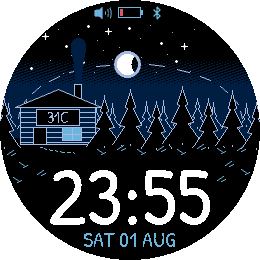 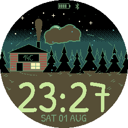 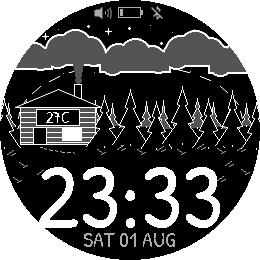 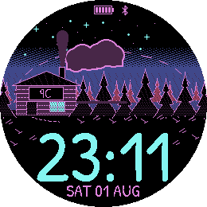 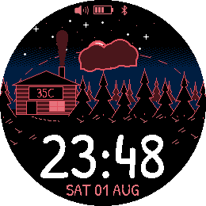 |

### Separate Repository

LCARS Stardate lives in [its own repository](https://github.com/AKlitbo/pebble-watchface-lcars), because its artwork follows the *Star Trek* fan project guidelines and carries a noncommercial licence the rest of these faces don't. Its `.pbw` is on that repository's releases page.

| Watchface | Preview |
| :--- | :--- |
| **LCARS Stardate**<br>[changelog](https://github.com/AKlitbo/pebble-watchface-lcars/blob/main/CHANGELOG.md) |          |

## Weather Sources

You pick the weather source in each face's settings page.

- **Open-Meteo**: the default. It's free and needs no account or key.
- **OpenWeatherMap**: free tier, needs an account and an API key.
- **WeatherAPI.com**: free tier, needs an account and an API key.

Any of them gives the faces temperature, conditions, wind, humidity, pressure, feels like, sunrise, and sunset. OpenWeatherMap's free tier has no UV index, dew point, today's high and low, chance of rain, or forecast, so the faces fill those in from Open-Meteo.

## Calendar

Gridlock's calendar panels read a private iCal (`.ics`) feed, so any service that publishes one works. Google Calendar's secret address is the usual one. Paste the feed URL into the settings page and upcoming events come in on their own.

Only each event's time, title, and location go to the watch, and events more than a week away are left out.

The feeds are read with [ical.js](https://github.com/kewisch/ical.js), which handles recurring events, exceptions, cancellations, and time zones. It's under the MPL 2.0 and ships as a separate file, see [NOTICES](NOTICES.md).

Alarms and attendees are left out.

## Stock Sources

Gridlock's Stock and Watchlist panels take their quotes from the source you pick in its settings page, where you also set your tickers and key. All of them are free, and all but Yahoo need an account and an API key.

- **Finnhub**: the default. Real-time US quotes, on your refresh interval.
- **Yahoo**: real-time, no API key, and the widest coverage (US and international stocks, ETFs, indices, and crypto). It's an unofficial feed, so it can break without notice.
- **Twelve Data**: global markets. It follows your interval while markets are open, no faster than every 15 minutes, then slows down after hours to stay within its daily limits.
- **Alpha Vantage**: one end-of-day quote after the close, with a small daily request allowance.

Each one gives the last price, the change and the percentage change, and the latest trading day.

## Bugs and Requests

I keep the issues for all my faces in one place, LCARS Stardate included, so please open bugs and requests in [Issues](https://github.com/AKlitbo/pebble-watchfaces/issues).

## Building Them Yourself

If you want to build a face yourself, you need [`paf`](https://github.com/AKlitbo/pebble-app-framework-cli#install) and the Pebble SDK. I run everything from WSL, because the build needs the SDK and `paf sync` installs `node_modules` for whichever system runs it. `paf doctor` tells you if anything is missing.

```sh
paf sync                      # fills every unit's paf/ from the framework tag in its paf.config.json and installs node_modules
paf build <face> [--clean]    # the .pbw, into the unit's targets/<face>/build/, from WSL with the Pebble SDK installed
paf build all                 # every face
```

The generators and tools work on one face, so they take its name and run in the unit that holds it:

```sh
paf gen <face> all             # every generator the face has inputs for
paf gen <face> <kind>          # one of clay, icons, thumbnails, background, or Mosaic's vibrant
paf tool <face> clay-preview   # the settings page in a browser, from the dev plugin
paf tool <face> tap-walk       # screenshot every state of the dev walk, from WSL
```

CI runs these checks in every unit, each against its own framework:

```sh
paf test
paf lint [--fix]       # the house style, from the code-style plugin
paf format --check     # the CSS, JSON, and YAML formatting
paf typecheck
paf check              # the Clay components, icons, and thumbnails are still current
```

`paf pin <unit> <tag>` moves a unit to another framework release. It prints the breaking changes between the two tags first.

Anything with a `.g.` in the name is generated, so I never edit those by hand. Rerun the matching `paf gen <face> <kind>`, and `paf check` says which one is out of date. Mosaic's vibrant tables are checked by a spec in `paf test` instead, and `mosaic/core/c/draw/value_bearing.g.h` comes from Gridlock's `src/tools/fonts/generate-bearing.py`.

### Project Structure

Each face of its own and each family under `watchfaces/` is a [paf](https://github.com/AKlitbo/pebble-app-framework-cli) unit, with its own copy of the shared [framework](https://github.com/AKlitbo/pebble-app-framework) in `paf/` on the tag its `paf.config.json` names. One unit can stay on a framework release while another moves ahead, and the faces in a family move together.

A face is any folder holding a `pebble.appinfo.json`, at `watchfaces/<face>/` or inside a family at `watchfaces/<family>/<face>/`. A family is a group of related faces plus the code only they share.

* **`watchfaces/<face>/`**: one face. `pebble.appinfo.json` holds its identity (uuid, version, message keys, resources), `src/c/` the device code, `src/pkjs/` the Clay config page and phone-side bridge, `resources/` its fonts and PNGs, and `CHANGELOG.md` its own release history. Some also carry a `frame/`, the HTML the backgrounds are baked from, or a `src/tools/` of generators only that face uses.
* **`watchfaces/<family>/core/`**: the family's shared code, staged into each member's build and reached as `<family>/...`.
* **`paf.config.json`**, **`package.json`**: in each unit, the framework tag it is on with the plugins it uses, and its scripts.
* **`config/`**: in each unit, its own test and typecheck setup in `vitest.config.ts` and the `tsconfig*.json` files. The lint comes from the framework's `code-style` plugin, which every unit lists, so no unit keeps an ESLint config. The unit's root `tsconfig.json` checks no files of its own and points an editor at them.
* **`paf/`**: in each unit, the shared framework, filled by `paf sync` and gitignored. It holds the base every face shares (`c/` device code, `ts/` PebbleKit JS, `waf/` the build helpers), the build and generator tooling under `tools/`, and the plugins the unit lists under `plugins/`.
* **`targets/<target>/`**: in each unit, the build sandbox waf runs in, generated and gitignored. Usually `targets/<face>/`, unless the face declares a `targets` map in its appinfo and gets one sandbox per target.
* **`vendor/`**: third-party source SVGs every unit's icons generator reads (gitignored, see [Third-Party Assets](#third-party-assets)).

### Adding a Face

To add a face, create `watchfaces/<name>/` with the layout above. Copy `paf.config.json`, `package.json`, `config/`, `tsconfig.json`, and `.gitignore` from another face of its own, then run `paf pin <name> <tag>`, which also writes the `package-lock.json` to commit. The sandbox, manifest, and waf entry point all come from the face's name and appinfo. Add the face and its unit to the matrix in [.github/workflows/ci.yml](.github/workflows/ci.yml) so it builds on every push.

To join a family instead, create it at `watchfaces/<family>/<name>/`. It builds on the family's framework, and the family's `core/` is compiled in because of where the face sits.

## How I Release Them

I release a face by pushing a `<face>-v<version>` tag. [release.yml](.github/workflows/release.yml) then builds that face, takes the notes from the matching section of its changelog, and publishes the `.pbw`.

```sh
# date the [1.7.0] heading in watchfaces/radar-array/CHANGELOG.md first, then
git tag radar-array-v1.7.0
git push origin radar-array-v1.7.0
```

Before it builds anything, the workflow checks that the tag matches `version` in the face's `pebble.appinfo.json`, that the changelog entry is dated, that the tag isn't already released, and that the unit's `paf/` holds a framework with a release version.

---

## Credits

* **Radar Array**
  * **Typography**: [Share Tech Mono](https://fonts.google.com/specimen/Share+Tech+Mono).
* **IDE VSCode**
  * **Typography**: [Teko](https://fonts.google.com/specimen/Teko) and [Share Tech Mono](https://fonts.google.com/specimen/Share+Tech+Mono).
* **Mosaic Faces**
  * **Typography**: [Teko](https://fonts.google.com/specimen/Teko) and [Share Tech Mono](https://fonts.google.com/specimen/Share+Tech+Mono) for the clock and values, with [LECO 2014](https://www.1001fonts.com/leco-2014-font.html), [Press Start 2P](https://fonts.google.com/specimen/Press+Start+2P), [Pixelify Sans](https://fonts.google.com/specimen/Pixelify+Sans), [Aldrich](https://fonts.google.com/specimen/Aldrich), [Kode Mono](https://fonts.google.com/specimen/Kode+Mono), [Electrolize](https://fonts.google.com/specimen/Electrolize), and [Quantico](https://fonts.google.com/specimen/Quantico) as header options.
  * **Glyphs**: Heart, step, distance, thermometer, UV, fire, snooze, late, clock, globe, calendar, alarm, and volume icons from [UXWing](https://uxwing.com).
  * **Calendar Reading**: [ical.js](https://github.com/kewisch/ical.js) by Philipp Kewisch, in Gridlock.
* **Sketchbook Faces**
  * **Typography**: [Patrick Hand](https://fonts.google.com/specimen/Patrick+Hand).
  * **Glyphs**: Heart, step, thermometer, and speaker icons from [UXWing](https://uxwing.com).
* **General**
  * **Weather Icons**: [Erik Flowers](https://github.com/erikflowers/weather-icons).
  * **Bluetooth Icons**: Bluetooth on / slash icons from [SVG Repo](https://www.svgrepo.com).
  * **Built With**: [Pebble SDK](https://developer.repebble.com) and [Clay](https://github.com/pebble-dev/clay).

## Third-Party Assets

The repo holds each face's fonts, icon PNGs, and baked backgrounds, each under its own licence, listed per face in [NOTICES](NOTICES.md). The SVGs behind the icons aren't mine to share, so they aren't in the repo. To regenerate the icons, download them into `vendor/weather-icons/`, `vendor/uxwing/`, and `vendor/svgrepo/`.

## Licence

**Source Code:** © 2026 Andrew Klitbo (Null Syntax). I release it under the [GNU Affero General Public License v3.0 or later](LICENSE). The shared framework in each unit's `paf/` is dual-licensed under the AGPL or the PolyForm Noncommercial License, and the LICENSE in its repository has the details.

You can use, change, fork, and share these faces under the AGPL. If you share a changed face, you share its source under the same licence. See [LICENSE](LICENSE) for the full terms.

Earlier history and releases of this repository were published under the PolyForm Noncommercial License 1.0.0, and copies taken from them keep those terms.

## Disclaimer

Visual Studio Code is a trademark of Microsoft. The **IDE VSCode** face is an unaffiliated homage and is not endorsed by or associated with Microsoft.

## AI Training Notice

Please do not use this repository or its contents for training, fine-tuning, or evaluating artificial intelligence or machine learning models, including large language models. That includes scraping, dataset construction, and inclusion in training corpora.

This is a request and not a term of the licence. The AGPL does not allow further restrictions to be added to it.
