# Gridlock Modules

Every panel Gridlock can put on the grid, shown at each size it supports.

The grid is five rows deep and four columns wide. Sizes are `rows × width`: `1×2` and `2×2` are half
width, `1×4` and `2×4` span the screen, and many panels come in more than one. Add any of them to a
layout from the settings page, then set its colour, header, and border on its own.

For what a finished screen looks like, see the layouts in the [README](../../README.md).

## Starter Layouts

Six preset buttons on the settings page, so there is something on screen before you have placed
anything yourself. Shown in Vibrant, and each one is a starting point rather than a mode: drop
panels in or take them out and it is your layout from there.

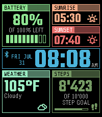 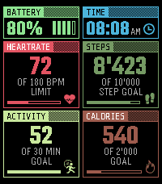 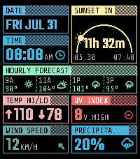 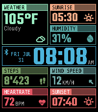 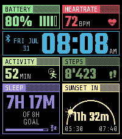 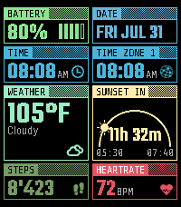

### 1×2

| | | | | | | |
|:--:|:--:|:--:|:--:|:--:|:--:|:--:|
| **Time**  | **Date**  | **Time Zone**  | **Week Number** 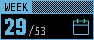 | **Weeks Left**  | **Day of Year**  | **Days Left**  |
| **Weekday Dots**  | **Julian Date**  | **Epoch Clock** 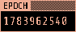 | **Beats**  | **Weather**  | **Temperature**  | **Feels Like**  |
| **Hi/Low**  | **Humidity**  | **Wind Speed**  | **Precipitation** 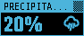 | **UV**  | **Pressure**  | **Dew Point**  |
| **Sunrise** 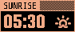 | **Sunset**  | **Sun** 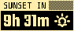 | **Moon**  | **Next Moon**  | **Heart Rate**  | **Steps**  |
| **Distance**  | **Calories** 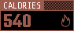 | **Sleep**  | **Activity** 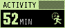 | **Battery**  | **Connection**  | **Quiet Time**  |
| **Status** 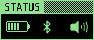 | | | | | | |

### 2×2

| | | | | | | |
|:--:|:--:|:--:|:--:|:--:|:--:|:--:|
| **Time + Date**  | **Big Hour** 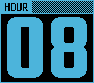 | **Big Minutes**  | **Analog** 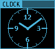 | **Beats**  | **Weather**  | **Conditions**  |
| **UV**  | **Daylight**  | **Sun**  | **Moon** 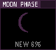 | **Heart Rate**  | **HR Graph**  | **Steps**  |
| **Steps Graph**  | **Distance** 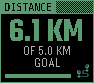 | **Calories**  | **Sleep**  | **Activity**  | **Next Event** 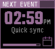 | **Timeline** 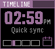 |
| **Stock**  | **Battery**  | | | | | |

### 1×4

| | | |
|:--:|:--:|:--:|
| **Digital Clock**  | **Forecast (Hourly)**  | **Forecast (4-Day)**  |
| **Next Event** 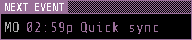 | **Timeline** 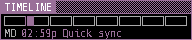 | |

### 2×4

| | | |
|:--:|:--:|:--:|
| **Big Time**  | **Forecast (Hourly)** 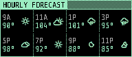 | **Forecast (4-Day)** 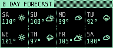 |
| **Agenda** 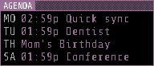 | **Timeline**  | **Watchlist**  |
| **Month Grid**  | | |
