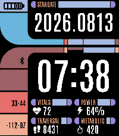
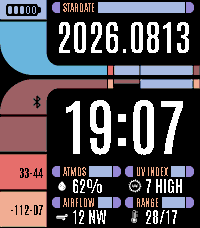
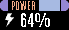
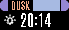
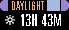
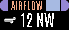
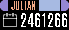
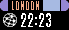

# LCARS Stardate Readouts

Every readout the four ops slots can show, at each size it supports.

The face has four pickable slots, two per column, under a fixed clock and stardate banner. A slot
carries no fixed reading. What it shows comes from the catalogue below, and its bar word and glyph
follow the pick, so changing a slot needs no new artwork for any theme.

For the themes themselves, see the previews in the [README](../../README.md).

## Arrangements

Six ways the same four slots read. Each is a picked set rather than a mode, so any readout can go
in any slot and you can mix them however you like.

     

## Slot

The ordinary size, and what all four slots take.

| | | | | | | |
|:--:|:--:|:--:|:--:|:--:|:--:|:--:|
| **Heart Rate**  | **Steps / Distance**  | **Battery**  | **Calories**  | **Sleep**  | **Active Minutes**  | **Moon Phase %**  |
| **Moon Phase Name**  | **Next Full / New Moon**  | **Sunrise**  | **Sunset**  | **Length of Day**  | **Next Sun Event**  | **Humidity**  |
| **Wind**  | **UV Index**  | **High / Low**  | **Julian Date**  | **Day of Year**  | **Week Number**  | **Temperature**  |
| **Conditions**  | **Epoch Clock**  | **Swatch Beats**  | **Alternate Time Zone**  | | | |

Epoch takes no glyph on purpose. Ten digits only fit once the row hands its icon space back to the
value, which any readout with no glyph gets. The alternate zone names its own bar from the city you
search for, so a slot set to London reads LONDON.

## Tall

One readout fills a whole column instead of a slot: the condition glyph over a large temperature,
at a size the ordinary rows cannot give it.

| |
|:--:|
| **Sensors Block**  |

It only goes in the upper left, which is the one column the face draws it in, and it takes the lower
left slot with it. The builder will not let you drop it anywhere else, and the firmware makes the
same correction, so a hand-edited setting cannot smuggle one into the right column.
